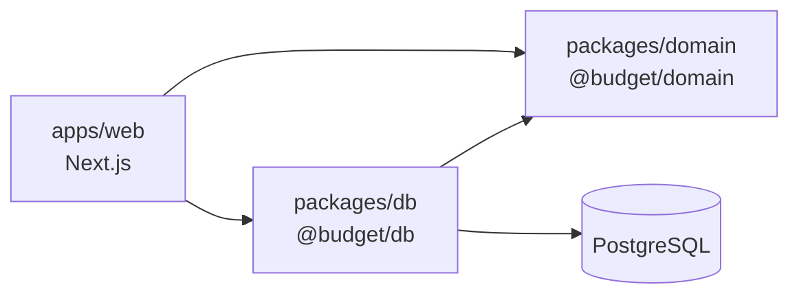

# Architecture : vue d'ensemble

Comment les pièces s'assemblent. Le pourquoi de chaque choix est dans `adr/`, les règles métier dans `domain/rules.md`.

## Paquets et dépendances



Les dépendances vont dans un seul sens :

- **`@budget/domain`** ne dépend de rien d'autre que TypeScript. Il définit les types métier et les calculs.
- **`@budget/db`** dépend du domaine pour ses types : il lit et écrit en base, et convertit les enregistrements Prisma en types du domaine, et inversement.
- **`apps/web`** orchestre : il authentifie, valide les entrées, charge les données via `@budget/db`, appelle le domaine, persiste le résultat et affiche.

Le domaine n'importe jamais `@budget/db` ni Next.js ; `@budget/db` n'importe jamais Next.js.

## Arborescence indicative

```
apps/web/
  app/
    (auth)/sign-in/          connexion
    (app)/                   pages protégées
      page.tsx               dashboard du mois
      months/[month]/        ouverture, clôture, opérations d'un mois
      settings/              postes fixes, enveloppes, provisions, catégories
  actions/                   Server Actions, une par intention (addExpense, openMonth…)
  schemas/                   schémas Zod des entrées
  lib/auth.ts                configuration Better Auth
  lib/session.ts             récupération et vérification de la session
  components/                composants UI (shadcn/ui)
  middleware.ts              redirection vers /sign-in si non connecté
  scripts/create-user.ts     création du compte unique

packages/domain/src/
  money.ts                   type Money et arrondis
  month.ts                   type Month (AAAA-MM) et arithmétique des mois
  budget/                    reste à vivre, enveloppes, alertes (R9 à R16)
  provisions/                cibles, échéances, consommation (R17 à R23)
  months/                    ouverture, clôture, réouverture (R4 à R7, R24 à R30)
  index.ts                   API publique du paquet

packages/db/
  prisma/schema.prisma
  prisma/migrations/
  src/repositories/          accès aux données, retournent des types du domaine
  src/mappers/               conversions Prisma ↔ domaine (Date ↔ AAAA-MM…)
  src/client.ts              instance Prisma partagée
```

## Parcours types

### Lecture : afficher le dashboard

1. Le Server Component de `(app)/page.tsx` vérifie la session.
2. Il charge le mois ouvert, son instantané et ses opérations via les repositories de `@budget/db`.
3. Il appelle le domaine pour les valeurs dérivées : restants, niveaux d'alerte, soldes, marge prévisionnelle.
4. Il rend l'affichage. Aucun calcul métier dans les composants.

### Mutation : saisir une dépense

1. Le formulaire appelle la Server Action `addExpense`.
2. L'action vérifie la session, puis valide l'entrée avec son schéma Zod.
3. Elle charge le contexte nécessaire (mois, enveloppe ou provision, solde).
4. Elle appelle le domaine, qui applique les règles (rattachement au mois, mois ouvert, dépassement d'une provision…) et renvoie soit le résultat à persister, soit une erreur métier typée.
5. Elle persiste via `@budget/db`, puis invalide le cache des pages concernées (`revalidatePath`).
6. Elle renvoie un résultat que le formulaire traduit en message.

### Opérations de mois : ouvrir, clôturer, rouvrir

Même schéma, avec une contrainte de plus : toutes les écritures d'une opération de mois se font dans **une seule transaction**. L'ouverture crée le mois et toutes ses lignes d'instantané ; la clôture enregistre la répartition du reliquat, les versements qui en découlent et le changement de statut. Aucun état intermédiaire ne doit être visible.

## Où vit quoi

| Responsabilité | Emplacement |
|---|---|
| Règle métier, calcul, validation d'invariant métier | `packages/domain` |
| Validation de forme des entrées client | `apps/web/schemas` (Zod) |
| Contrôle d'accès | `apps/web/lib/session.ts`, appelé dans chaque Server Action et page |
| Requêtes, transactions | `packages/db/src/repositories` |
| Conversions de types (dates, montants) | `packages/db/src/mappers` |
| Contraintes d'intégrité | schéma Prisma et SQL des migrations |
| Mise en forme (euros, dates, couleurs d'alerte) | `apps/web/components` |

Deux niveaux de validation coexistent : Zod vérifie que l'entrée est bien formée (un montant est un nombre positif), le domaine vérifie qu'elle est permise (le mois est ouvert).

## Sécurité en couches

- Le middleware redirige les visiteurs non connectés, mais **n'est jamais la seule protection** : chaque Server Action, Route Handler et page protégée revérifie la session.
- Les Server Actions sont des points d'entrée publics : elles valident systématiquement leurs arguments, même appelées depuis un formulaire de l'app.
- Les secrets ne sont lus que côté serveur ; aucune variable sensible ne porte le préfixe `NEXT_PUBLIC_`.

## Tests

| Cible | Où | Base de données |
|---|---|---|
| Règles métier (exemples de `rules.md`) | `packages/domain` | non |
| Mappers et repositories | `packages/db` | oui, base de test |
| Server Actions critiques (ouverture, clôture) | `apps/web` | oui, base de test |