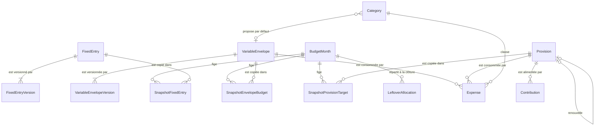

# Modèle du domaine

Structure des concepts : entités, relations, cycles de vie. Les définitions sont dans `glossary.md`, les calculs dans `rules.md`, la traduction en tables PostgreSQL dans `../adr/0009-postgresql-and-prisma.md`.

Une notation `A.b[]` désigne une collection d'éléments qui n'existent pas sans `A` : chacun a sa propre entité ci-dessous.

## Entités

### Paramétrage

**FixedEntry**
- `id`, `label`, `type` : `charge` | `scheduledSaving`
- `versions[]` : `FixedEntryVersion`
- `archivedAt?`

**FixedEntryVersion**
- identité : (`fixedEntryId`, `effectiveFrom`)
- `amount`

**VariableEnvelope**
- `id`, `label`
- `versions[]` : `VariableEnvelopeVersion`
- `archivedAt?`

**VariableEnvelopeVersion**
- identité : (`envelopeId`, `effectiveFrom`)
- `mode` : `amount` | `percentage`, `value`

**Provision**
- `id`, `label`, `type` : `deadline` | `reserve`, `target`
- si `deadline` : `startMonth`, `durationMonths`
- si `reserve` : `monthlyAmount`
- `status` : `active` | `late` | `closed`, `closedAt?`
- `previousCycleId?` : provision dont elle est le renouvellement

**Category**
- `id`, `label`, `defaultEnvelopeId?`

### Mois

**BudgetMonth**
- `month` (`AAAA-MM`), `status` : `open` | `closed`
- `income`, `openedAt`, `closedAt?`, `reopenedAt?`
- `fixedEntries[]` : `SnapshotFixedEntry`
- `envelopeBudgets[]` : `SnapshotEnvelopeBudget`
- `provisionTargets[]` : `SnapshotProvisionTarget`

L'instantané (`MonthSnapshot`) est l'ensemble de ces trois collections. Il n'a pas d'existence propre en base : c'est un objet assemblé à la lecture, que le domaine reçoit pour ses calculs.

**SnapshotFixedEntry**
- identité : (`month`, `fixedEntryId`)
- `label`, `type`, `amount` : copiés à l'ouverture
- `status` : `planned` | `done`

**SnapshotEnvelopeBudget**
- identité : (`month`, `envelopeId`)
- `label`, `mode`, `value`, `budget` : copiés ou calculés à l'ouverture

**SnapshotProvisionTarget**
- identité : (`month`, `provisionId`)
- `label`, `target` : copiés ou calculés à l'ouverture

Les libellés sont copiés volontairement : renommer un élément ne modifie pas les mois passés.

**LeftoverAllocation**
- `month`, `destination` : `savings` | `provision`, `provisionId?`, `amount`

### Opérations

**Expense**
- `id`, `date`, `amount`, `place?`, `description?`, `categoryId`
- `source` : `{ type: envelope, envelopeId }` | `{ type: provision, provisionId }`
- `savingsDraw` : montant financé par l'épargne, 0 si aucun

**Contribution**
- `id`, `date`, `amount`, `provisionId`
- `origin` : `manual` | `closing`

## Relations



## Données dérivées

Ces valeurs sont toujours calculées, jamais stockées, pour éviter toute dérive :
- solde d'une provision : `Σ Contribution − Σ (Expense.amount − Expense.savingsDraw)` ;
- consommé, restant et niveau d'alerte d'une enveloppe sur un mois ;
- reste à vivre, base de répartition, marge prévisionnelle (à partir de l'instantané) ;
- montant financé par l'épargne d'un mois clôturé : l'opposé du reliquat s'il est négatif, 0 sinon ;
- places connues et dernière catégorie utilisée (à partir des dépenses).

## Cycles de vie

**BudgetMonth**
`(inexistant)` → `open` à l'ouverture → `closed` à la clôture. Le dernier mois clôturé peut repasser à `open` par réouverture (R29).

**Provision à échéance**
```
active ──échéance clôturée, incomplète──▶ late ──prolonger──▶ active
active / late ──clôturer ou renouveler──▶ closed
renouveler ──crée──▶ nouvelle Provision active (previousCycleId)
```

**Réserve** : `active` jusqu'à clôture manuelle.

## Versionnement et instantanés

Le paramétrage est versionné par `effectiveFrom`. Pour un mois donné, la version en vigueur est la plus récente dont `effectiveFrom` est antérieur ou égal au mois. L'ouverture crée les lignes d'instantané à partir de ces valeurs ; tant que le mois est ouvert, une modification qui prend effet au mois en cours les met à jour (R7) ; les calculs d'un mois lisent uniquement son instantané, jamais le paramétrage courant. Un mois clôturé ne change donc jamais, même si le paramétrage évolue ; seule une réouverture permet d'en corriger les opérations, sans toucher à son instantané.
